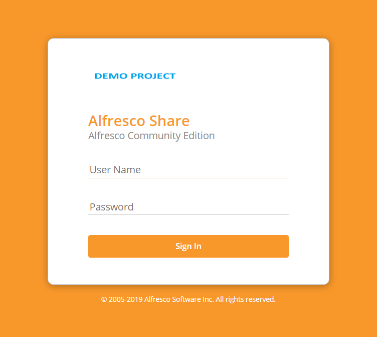
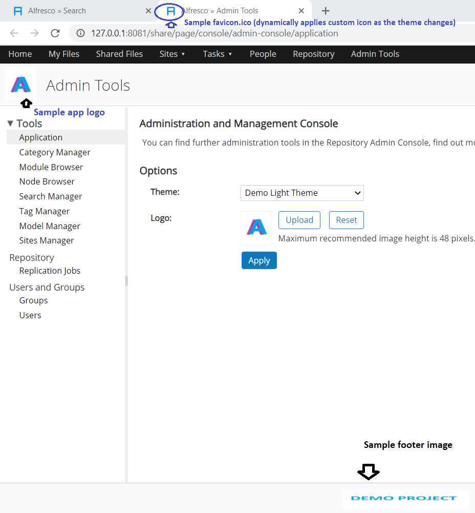
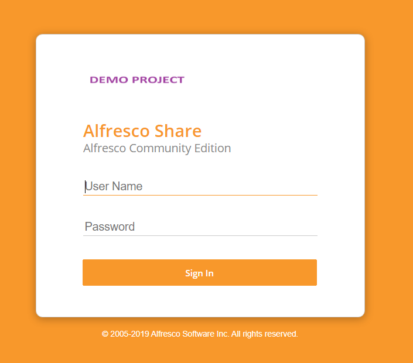
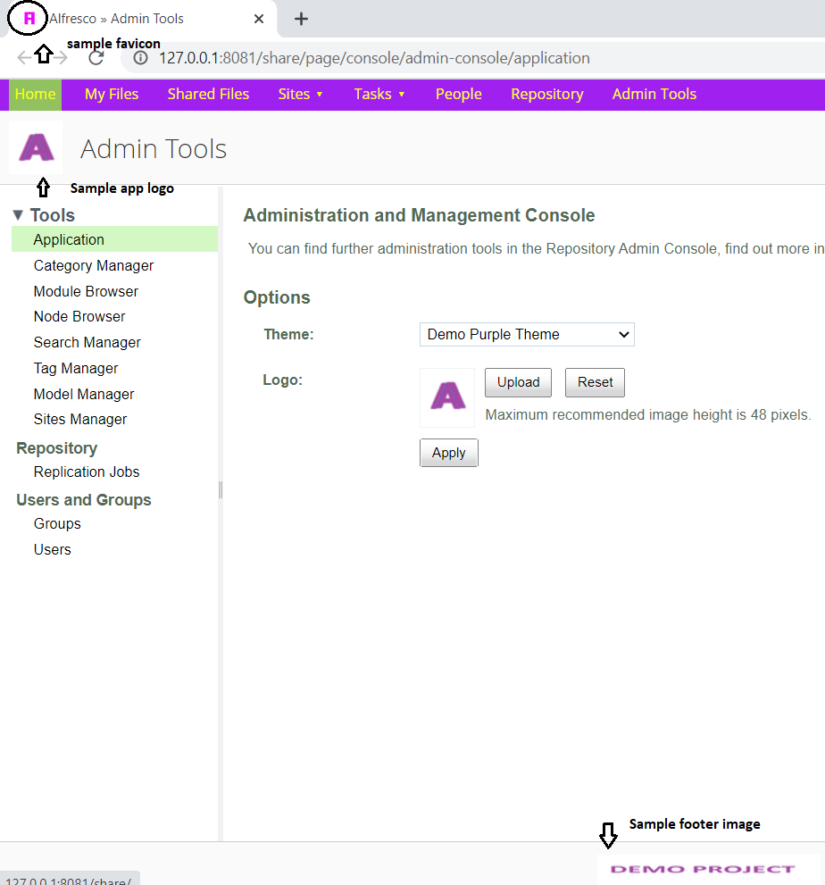

# share-theme-demo
Alfresco Share Theme Demo

This project includes demo share theme projects on ACS 5.2.x and ACS 6.2.x. It contains 2 sample share themes which are created by extending out of the box themes. It also allows setting the favicon dynamically as the theme changes.

- Sample Themes:
  - Demo Light Theme  (created by taking reference from ootb Light Theme)
    

        
       
       
        
    

  - Demo Purple Theme (created by taking reference from ootb Green Theme)
    

        
       
       
        
    

#### References:

- ACS 6.2.x
  - https://docs.alfresco.com/6.2/concepts/dev-extensions-share-themes.html
  - https://docs.alfresco.com/6.2/tasks/dev-extensions-share-tutorials-add-theme.html
  
- ACS 5.2.x
  - https://docs.alfresco.com/5.2/concepts/dev-extensions-share-themes.html
  - https://docs.alfresco.com/5.2/tasks/dev-extensions-share-tutorials-add-theme.html
